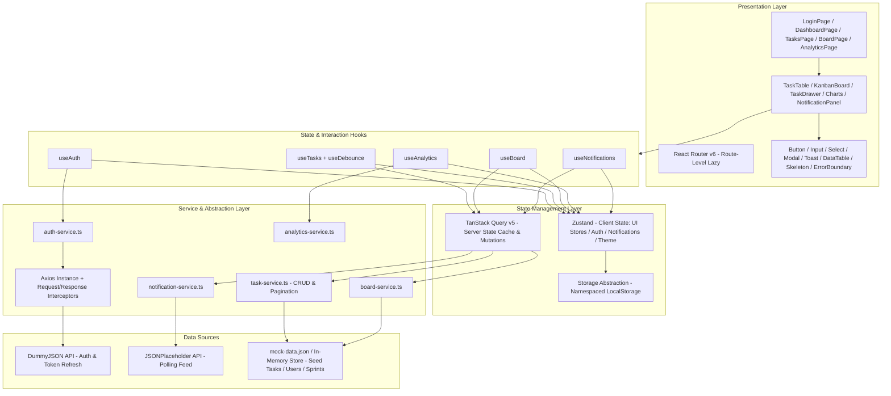
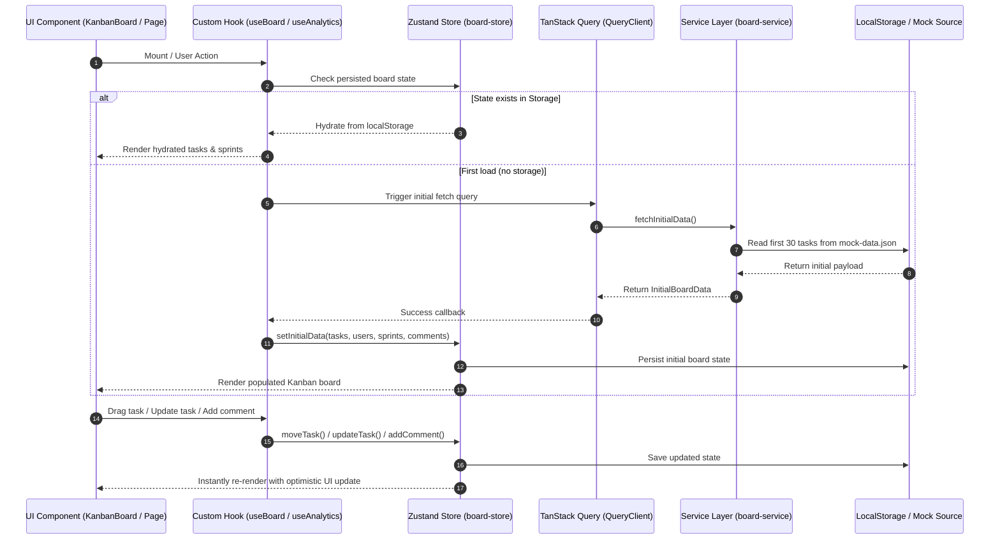
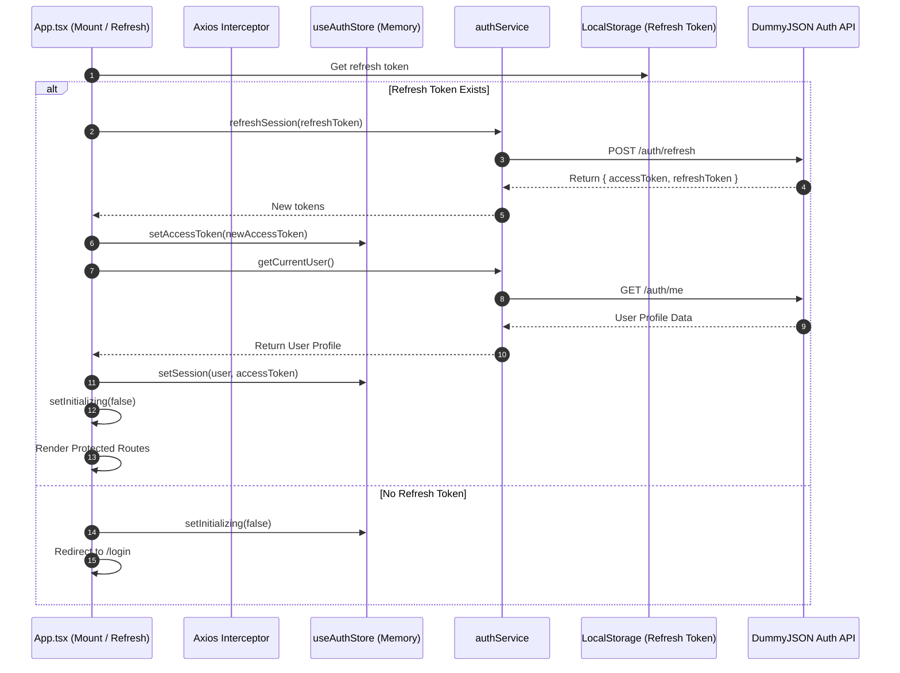
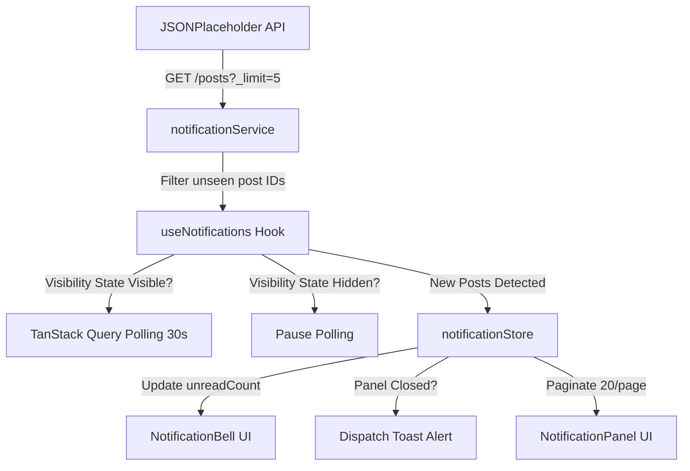

# SprintDesk — System Architecture Document

## 1. Project Overview

**SprintDesk** is a production-grade, single-page Sprint Management Dashboard engineered for software development teams. The platform provides a unified workspace for managing sprint lifecycles with real-time interactive Kanban workflows, data visualizations, background notification feeds, role-based session lifecycle management, and a custom design system built from scratch.

---

## 2. Architecture Goals

- **Separation of Concerns**: Strict multi-tier separation between UI, custom hooks, server-state caching (TanStack Query), interactive client state (Zustand), and data access services.
- **Strong Type Safety**: End-to-end TypeScript with strict mode (`strict: true`), zero `any` types, and shared model contracts.
- **Robust State Segregation**: Clear division preventing server data from polluting client stores and keeping transient UI state localized.
- **Accessibility & Responsiveness**: WCAG 2.1 AA accessible UI with keyboard navigation, ARIA dialogs/forms, and mobile viewport adaptability (down to 375px).
- **Resilient Security**: In-memory access token storage, transparent silent token refresh with concurrent request deduplication, and zero credentials in bundle storage.
- **Zero Third-Party UI Kits**: 100% custom-crafted, accessible design system using Tailwind CSS utility classes.

---

## 3. Technology Stack

| Category         | Technology     | Version    | Purpose                                             |
| ---------------- | -------------- | ---------- | --------------------------------------------------- |
| **Framework**    | React          | `18.3.1`   | Core UI engine                                      |
| **Language**     | TypeScript     | `~6.0.2`   | Strict mode typing (`strict: true`)                 |
| **Build Tool**   | Vite           | `^8.2.0`   | Fast dev server & optimized bundle building         |
| **Server State** | TanStack Query | `v5.101.4` | Caching, deduplication, polling lifecycle           |
| **Client State** | Zustand        | `v5.0.15`  | Global board, auth, notification & theme stores     |
| **Styling**      | Tailwind CSS   | `v3.4.19`  | Custom design tokens, dark mode, animations         |
| **Routing**      | React Router   | `v6.30.6`  | Route-level code-splitting with `lazy` & `Suspense` |
| **Charts**       | Recharts       | `v3.10.1`  | Responsive, animated data visualizations            |
| **Drag & Drop**  | @dnd-kit/core  | `v6.3.1`   | Accessible pointer & keyboard DnD                   |
| **Testing**      | Vitest + RTL   | `v4.1.11`  | Unit & component integration testing (72 tests)     |

---

## 4. High-Level Architecture



---

## 5. Folder & Feature Structure

```text
src/
├── api/                        # HTTP client, endpoint constants, and Axios interceptors
│   ├── client.ts               # Configured Axios instance
│   ├── endpoints.ts            # Centralized API endpoint constants
│   └── interceptors.ts         # Request/response interceptor with concurrent 401 refresh queue
├── app/                        # Application core setup
│   ├── providers/              # React Query and Theme providers
│   ├── router/                 # Route configuration, ProtectedRoute, PublicRoute
│   └── App.tsx                 # Root application component with auth initialization loader
├── components/
│   ├── layout/                 # AppLayout, Header, Sidebar navigation
│   └── ui/                     # Custom Design System (Button, Input, Select, Modal, Toast, DataTable, Skeleton)
├── features/                   # Feature-based modular domains
│   ├── auth/                   # Login form, auth hooks, auth service, auth store
│   ├── board/                  # Kanban board, columns, task cards, task drawer, modals, filters
│   ├── analytics/              # Analytics charts (Velocity, Status, Priority, Trend), KPI cards
│   ├── dashboard/              # Active sprint overview, KPIs, and actionable tasks table
│   └── notifications/          # Notification bell, panel, item, polling hook, notification store
├── stores/                     # Theme store (light/dark mode)
├── types/                      # TypeScript definitions (auth, board, api, common)
├── utils/                      # ClassNames helper (cn), date formatters, constants, storage abstraction
└── tests/                      # Vitest unit and integration test suites
```

---

## 6. Application Data Flow



---

## 7. Authentication Architecture

The authentication system implements token segregation:

- **Access Token**: Stored strictly in memory within the Zustand `auth-store`. It is never written to `localStorage` or `sessionStorage`.
- **Refresh Token**: Stored in a namespaced `localStorage` key (`sprintdesk_refresh_token`).
- **Axios Interceptor**:
  - Automatically attaches `Authorization: Bearer <token>` to outbound requests.
  - Catches `401 Unauthorized` responses.
  - Queues concurrent failing requests while sharing a single `refreshPromise`.
  - Executes `POST /auth/refresh` against DummyJSON.
  - Retries all queued original requests with the new access token.
  - Prevents infinite loops by ignoring auth endpoints and requests with `_retry: true`.
- **Session Initialization**: On cold start or page refresh, `App.tsx` reads the refresh token and validates the session before rendering routes, displaying a `FullScreenLoader`.



---

## 8. API & Service Layer Architecture

The application isolates network logic into dedicated services:

1. `auth-service.ts`: Login, token refresh, and user profile queries.
2. `board-service.ts`: Initial task/sprint/user data loading from mock backend representations.
3. `analytics-service.ts`: Pure statistical calculation functions (Velocity, Status Distribution, Priority Breakdown, Completion Trend, KPIs).
4. `notification-service.ts`: JSONPlaceholder polling (`/posts?_limit=5`), post-to-notification transformations, and post ID deduplication.

---

## 9. TanStack Query Server-State Architecture

TanStack Query manages asynchronous server state:

- **Query Keys**: Centralized key definitions (`['board-initial-data']`, `['notifications-poll']`).
- **Caching & Deduping**: Automatic request deduplication across concurrent hooks.
- **Background Polling Control**: Query refetch intervals are dynamically wired to the browser's **Page Visibility API** (`refetchInterval: isPageVisible ? 30_000 : false` and `refetchIntervalInBackground: false`).

---

## 10. Zustand Client-State Architecture

Zustand manages interactive application state:

- `useAuthStore`: Memory-only `accessToken`, `user` profile, `isAuthenticated`, `isInitializing`.
- `useBoardStore`: Active tasks, comments, sprints, users, drag-and-drop reordering, priority/assignee filters, search queries, undo move history snapshot, and `localStorage` persistence.
- `useNotificationStore`: In-app notification list, unread counter, `knownPostIds` deduplication map, `toastedIds` record, and multi-page pagination slice.
- `useThemeStore`: Light/dark mode selection with system preference auto-detection.

---

## 11. Local Component State

Transient component state (such as dropdown open states, modal visibility, form input values, and hover tooltips) is kept local via `useState` and `useRef` to avoid unnecessary global store pollution.

---

## 12. Kanban Board Architecture

- **4 Fixed Columns**: `Backlog`, `In Progress`, `Review`, `Done`.
- **Seeding Rule**: Exactly the first 30 tasks from `mock-data.json` are loaded initially; users, sprints, and comments are fully loaded without arbitrary limits.
- **Data Attributes**: Each task card renders title, priority badge, assignee avatar, due date, and overdue indicators.
- **Task Drawer**: Slide-over panel with keyboard dismiss, inline editing for title/description, dropdown status/assignee/priority pickers, and real-time comment threads.
- **Task Management**: Modal dialogs for task creation with validation and task deletion with confirmation.

---

## 13. Drag-and-Drop Architecture

Built with `@dnd-kit/core` and `@dnd-kit/sortable`:

- **Sensors**: Configured with `PointerSensor` (with distance activation constraint) and `KeyboardSensor` (using `sortableKeyboardCoordinates`).
- **Containers**: Sortable contexts per column with collision detection using `closestCorners`.
- **Overlay**: `DragOverlay` renders a floating portal representation of the active task card during dragging.
- **Snapshot & Undo**: Every move records a pre-move state snapshot in `useBoardStore`, enabling one-click undo rollback.

---

## 14. Analytics & Data Transformation Flow

All analytics computations are pure functions in `analytics-service.ts`:

- **Sprint Velocity**: Derived from actual `Sprint` models and tasks associated with each `sprintId`.
- **Status Distribution**: Real-time percentage calculation across the 4 board columns.
- **Priority Breakdown**: Cross-tabulation of task priorities (Low, Medium, High) per column.
- **Completion Trend**: Cumulative completed task curve over time derived from real `completedAt` ISO timestamps.
- **Reactivity**: The `useAnalytics` hook binds directly to `useBoardStore`, causing charts to recompute instantly whenever board tasks are moved, added, or deleted.

---

## 15. Notification Polling Architecture



---

## 16. Design System Architecture

All 7 design system components are built from scratch using Tailwind CSS:

1. `Button`: Variants (`primary`, `secondary`, `outline`, `ghost`, `danger`), sizes (`sm`, `md`, `lg`), loading spinner, focus-visible rings.
2. `Input`: Labels, error messages, helper text, left/right icon slots, `aria-invalid`, `aria-describedby`.
3. `Select`: Accessible `<select>` wrapper with custom chevron, focus states, and error bindings.
4. `Modal`: Portal-rendered dialog with backdrop blur, focus trapping, ESC key listener, and `aria-modal="true"`.
5. `Toast`: Imperative `toast()` API, customizable duration, auto-dismiss timers, variant styling (`success`, `error`, `warning`, `info`).
6. `DataTable`: Generic typed table with sortable columns, custom cell renderers, striped rows, and empty states.
7. `Skeleton`: Animated pulse loaders in `text`, `circular`, and `rectangular` shapes.

---

## 17. Routing & Route Guard Architecture

Configured using React Router v6 with route-level code splitting:

- `/login`: Wrapped in `PublicRoute` (redirects authenticated users to `/dashboard`).
- `/dashboard`: Wrapped in `ProtectedRoute` inside `AppLayout`.
- `/board`: Wrapped in `ProtectedRoute` inside `AppLayout`.
- `/analytics`: Wrapped in `ProtectedRoute` inside `AppLayout`.
- `*`: `NotFoundPage` catch-all.

---

## 18. Error & Loading State Strategy

- **Route Loading**: `React.lazy` imports are wrapped in `<Suspense fallback={<RouteLoader />}>`.
- **Session Validation**: Full-screen initial loader (`<FullScreenLoader />`) prevents route flashing while validating sessions.
- **Empty States**: Dedicated visual empty states on the Kanban board, notification panel, and data tables.
- **Form Errors**: Inline field-level error messages with ARIA descriptor links.

---

## 19. Persistence Strategy

- **Board State**: Stored in `localStorage` under `sprintdesk_board_state`.
- **Notifications**: Stored in `localStorage` under `sprintdesk_notifications` and `sprintdesk_known_post_ids`.
- **Theme Preference**: Stored in `localStorage` under `sprintdesk_theme`.
- **Refresh Token**: Stored in `localStorage` under `sprintdesk_refresh_token`.
- **Access Token**: Kept in memory only.

---

## 20. Responsive Design Approach

- **Fluid Grid**: Mobile-first responsive breakpoints (`sm:`, `md:`, `lg:`, `xl:`).
- **Mobile Navigation**: Collapsible sidebar navigation with an overlay drawer on viewports `< 1024px`.
- **Kanban Board**: Horizontal touch-scroll container with min-width column cards on narrow screens.
- **Mobile Viewport Target**: Fully functional and verified at 375px mobile viewports.

---

## 21. Accessibility (a11y) Implementation

- **Keyboard Navigation**: ESC dismiss on modals/drawers/notification panels, Tab focus trapping in modals, keyboard sensor for drag-and-drop.
- **ARIA Semantics**: `role="dialog"`, `role="region"`, `role="alert"`, `aria-modal="true"`, `aria-labelledby`, `aria-describedby`, `aria-invalid`, `aria-busy`.
- **Form Controls**: Every input and select includes an explicit `<label htmlFor="...">` association.
- **Image Alt Tags**: Meaningful alt attributes on all avatars, user profile graphics, and fallback visuals.

---

## 22. Performance Optimization

- **Route Splitting**: Dynamic code splitting with `React.lazy` for all top-level routes.
- **Memoization**: Strategic `useMemo` for derived analytics data, filtered task lists, and lookup tables (`usersMap`).
- **Stable Callbacks**: `useCallback` on event handlers passed to child components.
- **Query Optimization**: In-flight request deduplication and tab-visibility-controlled background polling.

---

## 23. Testing Architecture

- **Testing Framework**: Vitest `4.1.11` + React Testing Library `16.3.2` + JSDOM `29.1.1`.
- **Test Coverage**:
  - `auth-interceptor.test.ts`: Bearer token attachment, 401 interception, silent refresh, request retry, deduplication.
  - `board-store.test.ts`: Task creation, column movement, reordering, deletion, undo snapshot, filter queries.
  - `analytics-service.test.ts`: Sprint velocity, status distribution, priority breakdown, completion trend calculations.
  - `notification-service.test.ts`: API polling, post transformation, ID deduplication.
  - `notification-store.test.ts`: Read/unread tracking, mark all as read, pagination calculations.
  - `notification-components.test.tsx`: Bell badge rendering, panel open/close, pagination controls.
  - `design-system.test.tsx`: Button, Input, Select, Modal, DataTable, Skeleton components.
  - `use-toast.test.tsx`: Hook-based toast trigger, variant assignment, dismissals.
  - `utils.test.ts`: Date formatters, class merging, storage helpers.
- **Total Test Suite**: **56 / 56 tests passing**.

---

## 24. Deployment Architecture

- **Hosting Platform**: Vercel.
- **SPA Fallback Configuration**:
  - `vercel.json` rewrite rule routing `/(.*)` to `/index.html`.
  - `public/_redirects` rule routing `/*` to `/index.html` (status 200).
  - Ensures deep links and page refreshes on `/dashboard`, `/board`, `/analytics`, and `/login` resolve without 404 errors.

---

## 25. Security Considerations

- **Memory-only Access Tokens**: Eliminates XSS token leakage from persistent web storage.
- **CORS & Timeout Controls**: Strict request timeout limits (10s) on auth calls.
- **Zero Committed Secrets**: `.env` and `.env.*` files are excluded in `.gitignore`. No private keys or production secrets are bundled.

---

## 26. Known Limitations & Future Roadmap

1. **Push Notifications**: Transitioning from 30-second polling to WebSocket / SSE connections for instant multi-user presence.
2. **E2E Test Suite**: Expanding test coverage to automated cross-browser Playwright workflows.
3. **Component Documentation**: Adding an isolated Storybook catalog with automated visual regression tests via axe-core.
4. **Report Exporting**: PDF/PNG export utilities for sprint review analytics.
