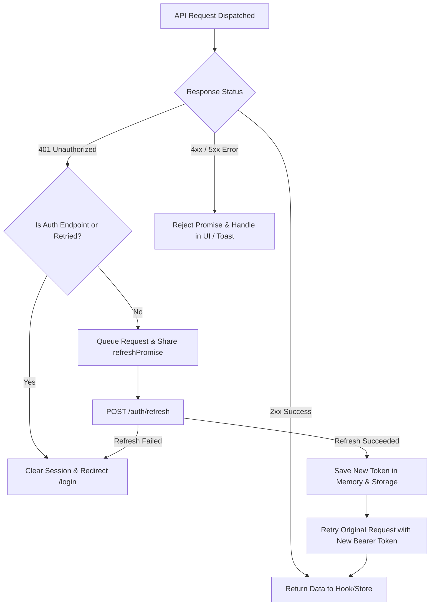

# SprintDesk — API Documentation

This document describes all external endpoints, simulated background polling services, and local data sources consumed by the SprintDesk application.

---

## Architecture & Data Access Pattern

SprintDesk follows a centralized multi-layer API data access pattern:

```text
UI Components (e.g., KanbanBoard, LoginForm, NotificationBell)
      │
      ▼
Hooks / Query Layer (useAuth, useBoard, useNotifications)
      │
      ▼
Service Layer (auth-service, board-service, notification-service)
      │
      ▼
Axios Client / Fetcher (apiClient with interceptors)
      │
      ▼
Data Source (DummyJSON Auth API / JSONPlaceholder Polling / Local Mock Data)
```

UI components never make raw `fetch()` or `axios` calls directly. All network access and data transformations are encapsulated inside dedicated service modules.

---

## 1. Authentication APIs (`https://dummyjson.com`)

Base URL: `https://dummyjson.com`  
Service File: `src/features/auth/api/auth-service.ts`

### 1.1 User Login

Authenticates user credentials and returns access and refresh tokens.

- **Method**: `POST`
- **Endpoint**: `/auth/login`
- **Authentication**: None (Public)
- **Headers**: `Content-Type: application/json`
- **Request Body**:
  ```json
  {
    "username": "emilys",
    "password": "emilyspass",
    "expiresInMins": 60
  }
  ```
- **Response (`200 OK`)**:
  ```json
  {
    "id": 1,
    "username": "emilys",
    "email": "emily.smith@x.dummyjson.com",
    "firstName": "Emily",
    "lastName": "Smith",
    "gender": "female",
    "image": "https://dummyjson.com/icon/emilys/128",
    "accessToken": "eyJhbGciOiJIUzI1NiIsInR5cCI6IkpXVCJ9...",
    "refreshToken": "eyJhbGciOiJIUzI1NiIsInR5cCI6IkpXVCJ9..."
  }
  ```
- **Error Response (`400 Bad Request`)**:
  ```json
  {
    "message": "Invalid credentials"
  }
  ```

---

### 1.2 Silent Token Refresh

Generates a fresh access token using the rotated refresh token stored in `localStorage`.

- **Method**: `POST`
- **Endpoint**: `/auth/refresh`
- **Authentication**: None (Requires valid refresh token in body)
- **Headers**: `Content-Type: application/json`
- **Request Body**:
  ```json
  {
    "refreshToken": "eyJhbGciOiJIUzI1NiIsInR5cCI6IkpXVCJ9...",
    "expiresInMins": 60
  }
  ```
- **Response (`200 OK`)**:
  ```json
  {
    "accessToken": "eyJhbGciOiJIUzI1NiIsInR5cCI6IkpXVCJ9...",
    "refreshToken": "eyJhbGciOiJIUzI1NiIsInR5cCI6IkpXVCJ9..."
  }
  ```
- **Error Response (`401 Unauthorized`)**:
  ```json
  {
    "message": "Invalid or expired refresh token"
  }
  ```
- **Frontend Handling**:
  Executed automatically inside the Axios response interceptor (`src/api/interceptors.ts`) when an API call encounters a `401 Unauthorized`. Concurrent requests share a single refresh promise, and failed original requests are retried transparently upon token renewal.

---

### 1.3 Get Current User Profile

Retrieves the currently authenticated user's profile data.

- **Method**: `GET`
- **Endpoint**: `/auth/me`
- **Authentication**: `Bearer <accessToken>`
- **Headers**:
  ```http
  Authorization: Bearer <accessToken>
  ```
- **Response (`200 OK`)**:
  ```json
  {
    "id": 1,
    "username": "emilys",
    "email": "emily.smith@x.dummyjson.com",
    "firstName": "Emily",
    "lastName": "Smith",
    "image": "https://dummyjson.com/icon/emilys/128"
  }
  ```
- **Error Response (`401 Unauthorized`)**: Triggers silent token refresh interceptor.

---

## 2. Notification Feed API (`https://jsonplaceholder.typicode.com`)

Base URL: `https://jsonplaceholder.typicode.com`  
Service File: `src/features/notifications/api/notification-service.ts`

### 2.1 Poll Recent Posts

Simulates a real-time notification stream by polling JSONPlaceholder posts.

- **Method**: `GET`
- **Endpoint**: `/posts?_limit=5`
- **Authentication**: None (Public)
- **Query Parameters**:
  - `_limit=5`: Constrains fetched records strictly to 5 posts per polling cycle.
- **Response (`200 OK`)**:
  ```json
  [
    {
      "userId": 1,
      "id": 1,
      "title": "sunt aut facere repellat provident occaecati excepturi optio reprehenderit",
      "body": "quia et suscipit suscipit recusandae consequuntur expedita et cum..."
    }
  ]
  ```
- **Frontend Transformation**:
  The service layer maps each post into an `AppNotification` model:
  ```typescript
  {
    id: post.id + 1000,
    title: post.title.slice(0, 40) + '...',
    message: post.body,
    type: post.id % 2 === 0 ? 'task' : 'review',
    read: false,
    createdAt: new Date().toISOString()
  }
  ```
- **Deduplication**: Unseen post IDs are compared against `knownPostIds` in `useNotificationStore`. Only new items increment the unread count and trigger closed-panel toast alerts.
- **Polling Lifecycle**: Polling executes every 30 seconds via TanStack Query and automatically suspends when the browser tab is hidden using the **Page Visibility API**.

---

## 3. Local Mock Backend Data (`mock-data.json`)

File: `mock-data.json`  
Service File: `src/features/board/api/board-service.ts`

The provided `mock-data.json` file serves as the initial data source representing a real backend database. The service layer imports and seeds the initial application state.

### 3.1 Initial Seeding Contract

- **Method**: `boardService.fetchInitialData()`
- **Seeding Rule**: Exactly the first 30 tasks are loaded into the active board state. Users, sprints, and comments are fully loaded to maintain relationship integrity.

### 3.2 Entities & Schemas

#### User Entity

```typescript
interface User {
  id: number;
  name: string;
  email: string;
  avatar: string;
}
```

#### Sprint Entity

```typescript
interface Sprint {
  id: number;
  name: string;
  startDate: string; // ISO Date String
  endDate: string; // ISO Date String
}
```

#### Task Entity

```typescript
interface Task {
  id: number;
  title: string;
  description: string;
  status: "backlog" | "in-progress" | "review" | "done";
  priority: "low" | "medium" | "high";
  assigneeId: number;
  dueDate: string; // ISO Date String
  sprintId: number;
  order: number;
  createdAt: string; // ISO Date String
  completedAt: string | null; // ISO Date String (used for Completion Trend analytics)
  updatedAt: string;
}
```

#### Comment Entity

```typescript
interface Comment {
  id: number;
  taskId: number;
  authorId: number;
  message: string;
  createdAt: string;
}
```

---

## 4. Error Handling & Retry Protocol


